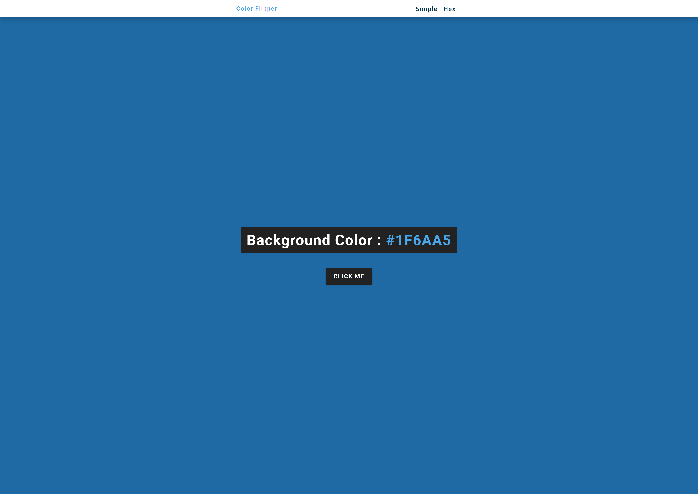
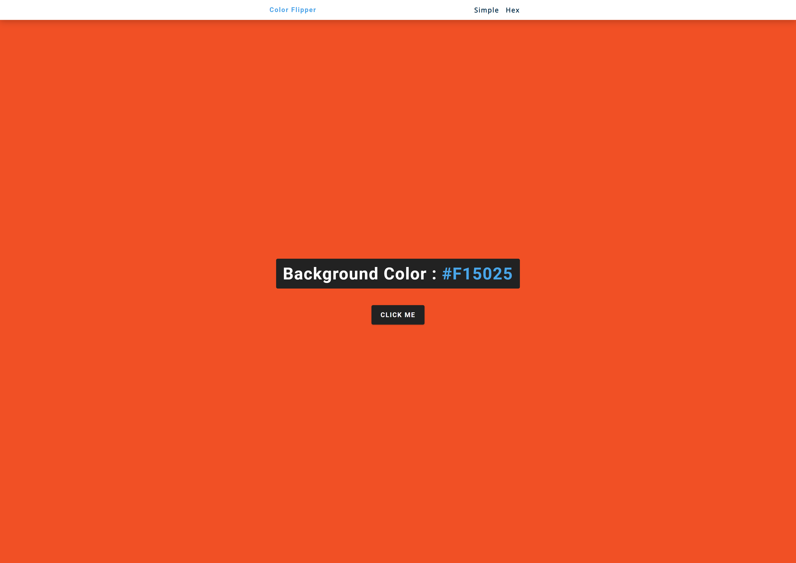

## Table of contents

- [Overview](#overview)
  - [The challenge](#the-challenge)
  - [Screenshot](#screenshot)
  - [Links](#links)
- [My process](#my-process)
  - [Built with](#built-with)
  - [What I learned](#what-i-learned)

## Overview

### The challenge

- The background color should change to a random color each time the user clicks the button.

### Screenshot

### Links

- Solution URL: [https://github.com/NandodkarAmogh/Color-flipper](https://github.com/NandodkarAmogh/Color-flipper)
- Live Site URL: [https://simplecolor-flipper.netlify.app/](https://simplecolor-flipper.netlify.app/)

## My process

### Built with

- HTML
- CSS custom properties
- Vanilla JavaScript

### What I learned

Through this project I learned 
- arrays
- document.getElementById()
- document.querySelector()
- addEventListener()
- document.body.style.backgroundColor
- Math.floor()
- Math.random()
- array.length

